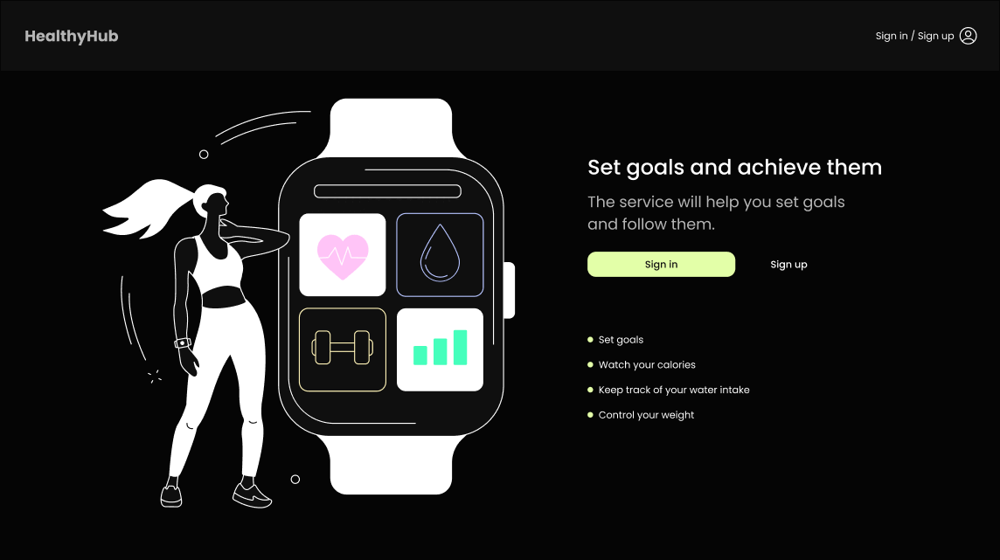

# WELCOME TO HEALTHY HUB!!!

HealthyHub, a user-friendly React application, is crafted to seamlessly support
you in managing your health and wellness endeavors. Whether you aim to monitor
your daily calorie intake, keep tabs on water consumption, or establish fitness
goals, HealthyHub is your go-to companion.

## Features

-**Calorie Tracking**: Maintain a comprehensive log of your daily calorie intake
for informed dietary decisions.

-**Hydration Monitoring**: Ensure optimal hydration by tracking daily water
consumption and setting hydration goals.

-**Nutrition Insights**: Gain access to nutritional details for a diverse range
of foods, facilitating healthy eating choices.

-**User-Friendly Interface**: The intuitive and responsive design of HealthyHub
caters to users of all ages, ensuring ease of use.

-**Data Visualization**: Witness your progress and accomplishments come to life
through interactive charts and graphs.

## Technologies Used

HealthyHub is built using the following technologies:

- [React](https://reactjs.org/)
- [Redux](https://redux.js.org/)
- [Chart.js](https://www.chartjs.org/)
- [Axios](https://axios-http.com/)
- [Node.js](https://nodejs.org/)
- [Mongoose](https://mongoosejs.com/)
- [Swagger](https://swagger.io/)
- [Husky](https://typicode.github.io/husky/)
- [Vite](https://vitejs.dev/)
- [Styled-Components](https://styled-components.com/)

## Links

- [Backend Repo](https://github.com/MaksymBora/Backend-SlimTrack360)
- [Swagger Docs](https://healthyhub-emsa.onrender.com/api/docs)
