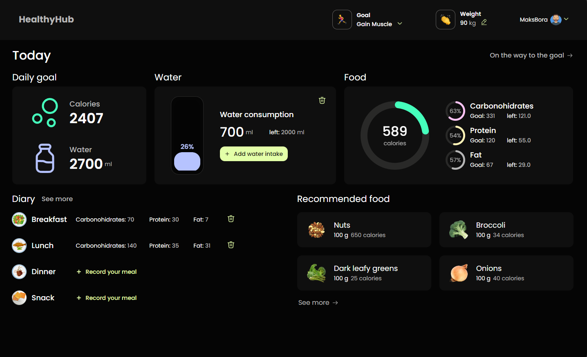
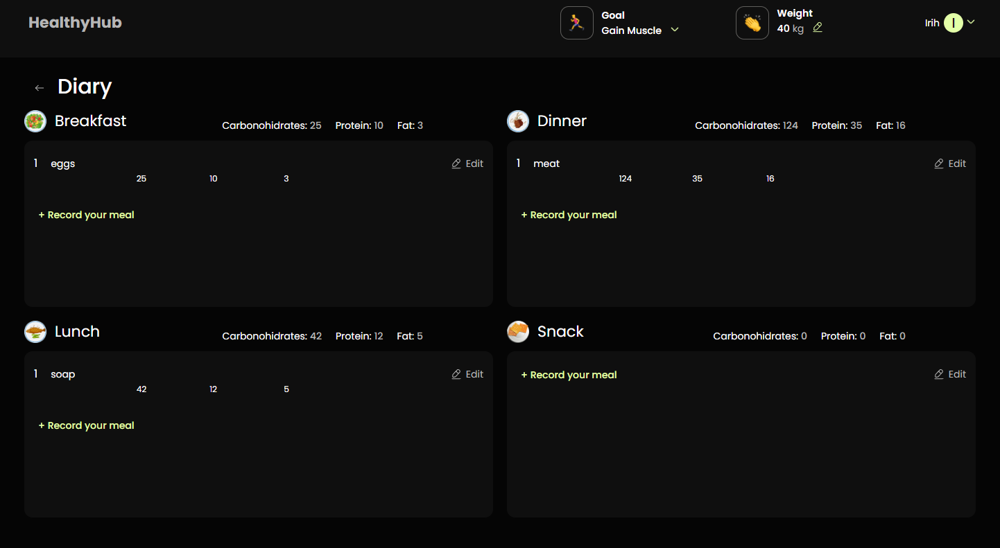
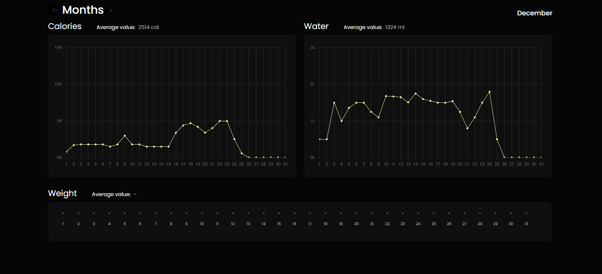

# WELCOME TO HEALTHY HUB!!!

HealthyHub, a user-friendly React application, is crafted to seamlessly support
you in managing your health and wellness endeavors. Whether you aim to monitor
your daily calorie intake, keep tabs on water consumption, or establish fitness
goals, HealthyHub is your go-to companion.

## Features

:runner: **Calorie Tracking**: Maintain a comprehensive log of your daily
calorie intake for informed dietary decisions. 

:sweat_drops: **Hydration Monitoring**: Ensure optimal hydration by tracking
daily water consumption and setting hydration goals. 

:corn: **Nutrition Insights**: Gain access to nutritional details for a diverse
range of foods, facilitating healthy eating choices. 

:computer: **User-Friendly Interface**: The intuitive and responsive design of
HealthyHub caters to users of all ages, ensuring ease of use. 

:chart_with_upwards_trend: **Data Visualization**: Witness your progress and
accomplishments come to life through interactive charts and graphs.

##

 On the main page, the user sees
5 mini-blocks where he can track his daily water and calorie goals. There is
also a display of a diary with meals with the possibility of deleting them. The
app also includes a feature to generate personalized food recommendations based
on their dietary needs.

##

 On the Diary page, the user can
record meals (in the appropriate blocks: breakfast, lunch, snack, dinner),
tracking the amount of carbohydrates, proteins, fats and calories consumed in
general. The data is also aggregated and transferred to the main page for the
convenience of using the application. The user can edit the entered data and add
an unlimited number of meals.

##

 On the Dashboard page, the
user has the opportunity to see his results and achievements by month in the
form of clear and convenient graphs

## Technologies Used

  <b>HealthyHub is built using the following technologies & tools:</b>

  &nbsp;
  &nbsp;
  &nbsp;
  &nbsp;
  &nbsp;
  &nbsp;
  &nbsp;
  &nbsp;
  &nbsp;
  &nbsp;
  &nbsp;
  &nbsp;

## Links

- [Backend Repo](https://github.com/MaksymBora/Backend-SlimTrack360)
- [Swagger Docs](https://healthyhub-emsa.onrender.com/api-docs/)

## Contributors

- **Team Lead:** [Maksym Borovichenko](https://github.com/MaksymBora)
- **Scrum Master:** [Iryna Husieva](https://github.com/IrinaHusieva)
- **Developers:** [Serhii Kuran](https://github.com/SergeyKuran) |
  [Maksym Chukhrai](https://github.com/MaksymChukhrai) |
  [Nina Mateichuk](https://github.com/MateichukNina) |
  [Yulia Halaniuk](https://github.com/yuliahalaniuk) |
  [Olena Pavlovska](https://github.com/OlenaPavlovska) |
  [Oleksii Kaba](https://github.com/Oleksii2005) |
  [Serhii Nesterov](https://github.com/NesterovSerhii) |
  [Yuriy Beregovoy](https://github.com/YuriyBeregovoy) |
  [Galyna Shevchenko](https://github.com/galu4ok) |
  [Tatiana Dubchak](https://github.com/TetyanaDubchak)
